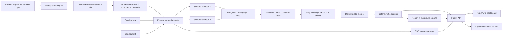
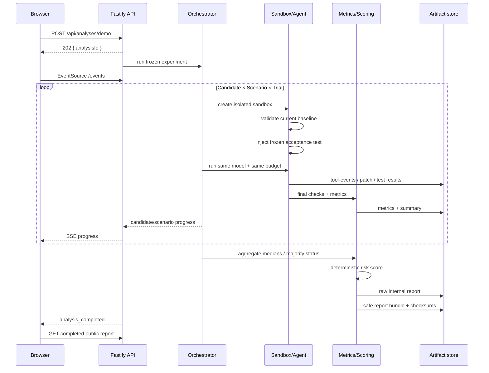

# FutureProof Architecture

FutureProof is a small TypeScript monorepo organized around one principle: **the generative agent is untrusted evidence-producing machinery; deterministic code owns measurement, scoring, persistence, and public exposure.**

## System map



The hackathon demo loads the already-frozen five scenarios from the fixture. The blind generator/critic exists as an engine capability and is tested independently; it is not allowed to inspect Candidate A/B implementation context when constructing future requirements.

## Workspace ownership

### `packages/core`

Owns shared data contracts and low-level persistence/path helpers.

Responsibilities include:

- scenario/run/report-adjacent schemas,
- artifact JSON/JSONL helpers,
- canonical `.futureproof/runs/<analysisId>` path construction.

It has no model or web dependency.

### `packages/engine`

Owns the experiment.

Key modules:

- `repository-analyzer.ts` — deterministic repository summary/import/export inspection.
- scenario generator/critic/validator modules — future requirement construction and neutrality checks.
- `sandbox-manager.ts` — fresh candidate copies and baseline validation.
- `agent-tools.ts` — path-safe file/search/edit/command surface.
- `coding-agent.ts` — tool-calling model loop and hard budgets.
- `regression-probe.ts` — current-test pressure snapshots after edits.
- `metrics.ts` — change surface, effort and structural measurements.
- `orchestrator.ts` — fair A/B scenario/trial scheduling and artifact lifecycle.
- `compare.ts` + `score.ts` — repeated-trial aggregation and deterministic Future Risk.
- `report-export.ts` — stable public JSON/Markdown plus SHA-256 manifest.
- `llm-client.ts` — OpenAI-compatible JSON/tool-call adapter.
- `real-model-smoke.ts` — small credential-gated adapter smoke contract.

### `apps/api`

Owns the public runtime boundary.

Fastify provides:

```text
POST /api/analyses/demo
GET  /api/analyses/:analysisId
GET  /api/analyses/:analysisId/events
GET  /api/analyses/:analysisId/scenarios/:scenarioId
GET  /api/analyses/:analysisId/scenarios/:scenarioId/candidates/:candidateId/trials/:trial/artifacts/:kind
GET  /api/analyses/:analysisId/exports/:exportName
```

The demo POST does not accept candidate paths or experiment overrides. Fixture roots are selected server-side.

### `apps/web`

Owns presentation and user interaction.

The React/Vite app implements:

- setup/start state,
- live SSE progress,
- A/B report dashboard,
- overall Future Risk and evidence metrics,
- scenario results table,
- keyboard-accessible scenario evidence drawer,
- opaque patch/event retrieval,
- server-generated report export.

Vite proxies `/api` to Fastify on port `3001` in development.

## Experiment lifecycle



## Artifact model

The canonical root is:

```text
.futureproof/runs/<analysisId>/
```

A candidate trial is stored beneath:

```text
<candidate>/<scenario>/trial-<n>/
  metadata.json
  tool-events.jsonl
  test-results.json
  patch.diff
  metrics.json
  summary.json
```

The analysis-level export bundle is:

```text
exports/
  report.json
  report.md
  manifest.json
```

`manifest.json` contains SHA-256 digests of the safe JSON/Markdown exports.

## Internal report vs. public report

FutureProof deliberately keeps two views of a completed analysis.

### Internal view

The in-process/internal report may contain `patchPath` and `artifactDir` so the server can locate evidence.

### Public view

Before a report leaves the API, every scenario run is sanitized. Public responses remove:

- `patchPath`
- `artifactDir`
- any direct server-root representation derived from those fields.

The same sanitization rule is applied to the export bundle.

The UI therefore cannot navigate arbitrary server paths. To inspect evidence it must supply only opaque experiment identifiers:

```text
analysisId + scenarioId + candidateId + trial + allowlisted artifact kind
```

The server reconstructs and validates the canonical path internally.

## Filesystem trust boundary

Sandbox tools treat model-generated file paths as untrusted input.

Before file access they enforce:

- relative paths only,
- no `..` traversal,
- no absolute paths,
- no escape through symlinks,
- a read-size cap,
- constrained patch semantics.

`apply_patch` requires the expected text to match exactly once. Ambiguous replacements fail instead of guessing.

## Process trust boundary

The coding agent does not receive a general shell.

Command execution is an exact allowlist for the configured test/build commands. Shell chaining, redirects, arbitrary network commands, destructive commands, and deployment/push commands are rejected before a child process is spawned.

A wall-clock timeout kills allowed commands that run too long.

## Agent budgets

The orchestrator passes a fixed budget to each comparable run. The included demo uses:

```text
max tool calls: 35
max tokens:     30,000
max test cycles: 8
wall timeout:   180,000 ms
```

The coding-agent loop records its stop reason, including completion, tool budget, token budget, and timeout.

## Hidden measurement boundary

Regression probes are triggered by edit operations and persisted as evidence. The coding model does not receive the hidden regression-area score. This keeps the metric as an observer signal rather than a target the agent can directly game.

## Deterministic scoring boundary

The LLM never receives authority to assign Future Risk.

`compare.ts` aggregates repeated trials and constructs candidate evidence. `score.ts` converts that evidence to deterministic `0–100` dimensions and an overall weighted score.

If an LLM is used to explain results, numeric claims are checked against supplied evidence; unsupported numbers cause a deterministic fallback explanation.

## Progress architecture

The orchestrator emits candidate-level progress:

```text
candidate_started
candidate_completed
```

The API derives scenario-level lifecycle events and uses `ProgressBus` to expose finite/live Server-Sent Events (SSE). A completed or failed analysis returns a finite SSE history ending in a terminal event; a running analysis keeps the stream open until a terminal event arrives.

The UI's progress state is therefore driven by backend execution events rather than a fake client timer.

## Export architecture

On successful completion the API persists evidence before marking the analysis `completed`:

1. canonical internal `report.json`,
2. safe deterministic export bundle,
3. checksum manifest,
4. only then the public completed state.

This ordering makes the invariant useful to clients:

> If `GET /api/analyses/:id` says `completed`, the report/export artifacts are already materialized.

The export endpoint uses an exact filename allowlist:

- `report.json`
- `report.md`
- `manifest.json`

## CI architecture

Normal CI is reproducible and does not require paid model calls.

It covers:

- Node engine/API/golden tests,
- React component tests,
- web TypeScript typecheck,
- Vite production build,
- Playwright Chromium desktop/mobile QA,
- fixture behavior verification,
- Candidate A/B typechecks.

The deterministic golden test runs the 14-execution orchestration path with injected deterministic agent behavior while preserving real artifact/scoring/export code.

A separate manual workflow is reserved for the real OpenAI-compatible adapter smoke. This prevents external availability, credentials, token cost, or model variance from making the core CI irreproducible.

## Current deliberate scope

The MVP supports the controlled TypeScript/npm fixture needed for the hackathon demonstration. Future generalization points include:

- additional package managers,
- additional languages/build systems,
- dependency installation inside hardened execution environments,
- repository/PR ingestion rather than the server-owned demo fixture,
- scenario generation and acceptance-test synthesis for broader domains,
- richer container/VM isolation for untrusted arbitrary repositories.
